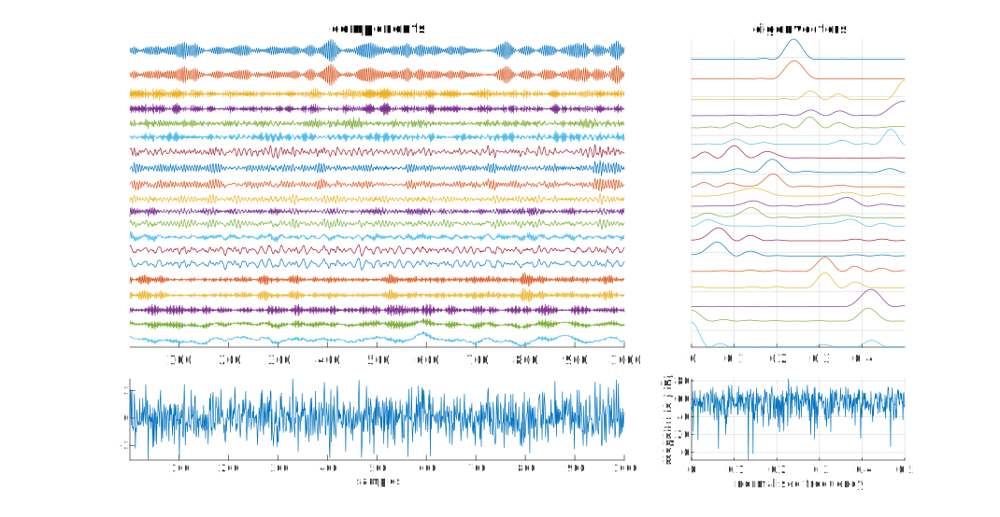
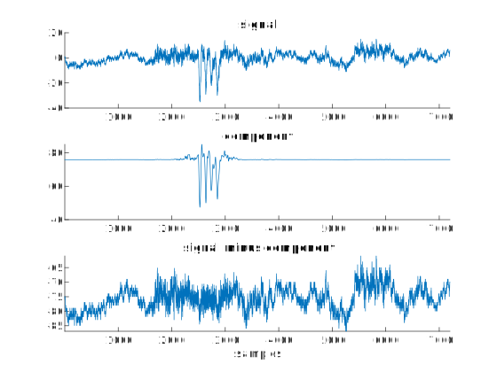
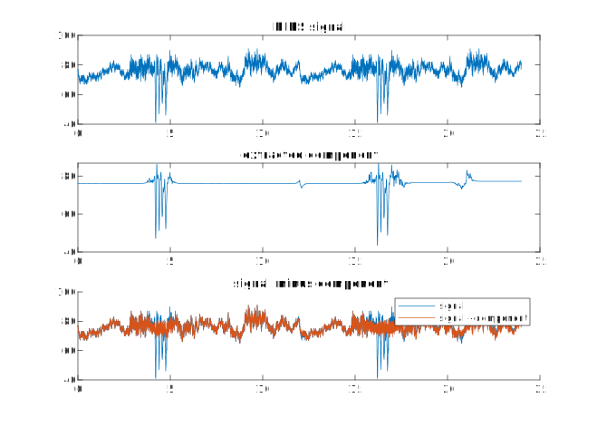

# Method to extract transient components in cerebral oxygenation signals

Matlab code for a decomposition method to extract transients from cerebral oxygenation
signals of preterm infants. The method uses singular spectrum analysis in an iterative
approach. Designed for cerebral oxygenation signals of preterm infants measured using a
near infrared spectroscopy (NIRS) device, but may be applicable in other areas. See below
for more details:

`O'Toole JM. Dempsey EM, Boylan GB (2018) 'Extracting transients from cerebral
oxygenation signals of preterm infants: a new singular-spectrum analysis method' in
Int Conf IEEE Eng Med Biol Society (EMBC), IEEE, pp. 5882--5885`
[DOI:10.1109/EMBC.2018.8513523](https://doi.org/10.1109/EMBC.2018.8513523)

Please cite the above reference if using this code to generate new results.


---
[Requirements](#requires) | [Example](#example) | [Functions](#functions) | 
[Licence](#licence) | [Contact](#contact)


## Requires
Matlab ([Mathworks](http://www.mathworks.co.uk/products/matlab/)) version R2020a or newer
with the signal processing toolbox. (Should work on older versions but not tested.)

Add the path for this project in Matlab [how to add
  path](https://uk.mathworks.com/help/matlab/matlab_env/add-remove-or-reorder-folders-on-the-search-path.html). Can
  do also so by:
```matlab
>> add_path_here();
```


## Example
Using a [synthetic NIRS test signal](https://github.com/otoolej/synth_NIRS_signals), extract transient componets
using a short-time approach:

```
  % load the default parameters and a test signal:
  params = decomp_PARAMS;
  d = load([params.DATA_DIR 'test_signal.mat']);
  
  % extend test signal with copy of itself:
  x2 = [d.x_test d.x_test];
  fs = 1 / 6;
  db_plot = true;
  
  % short-time, iterative approach to decomposition
  x_st = shorttime_iter_SSA_decomp(x2, fs, params, db_plot);
```


## Functions

+ set parameters in `decomp_PARAMS.m` file

+ `ssa_filter_bank_approach()` singular spectrum analysis (SSA) using a filter-bank approach

   ```
   % decompose random Gaussian noise and plot:
   x = randn(1, 1000);
   ssa_filter_bank_approach(x, 20, [], true);
   ```
   

+ `noise_reduction_SSA()` extract signal component using SSA with the DCT transform
   
   ```
   % load the default parameters and a test signal:
   params = decomp_PARAMS;
   d = load([params.DATA_DIR 'test_signal.mat']);
   
   % set parameters (default values):
   L = params.L_ssa_ev;
   method = params.SSA_METHOD;
   use_dct = params.USE_DCT;
   frac_dct_ignore = params.DCT_CUTOFF;
   db_plot = true;
   remove_mean = true;
   d_max = L/10;
   db_plot = true;
   
   % extract the signal component:
   [yb, d] = noise_reduction_SSA(d.x_test, L, method, use_dct, frac_dct_ignore, remove_mean, d_max, db_plot);
   ```
   
   
+ `iterative_SSA_decomposition()` run SSA iteratively, with increasing embedding
  dimension:
  
  ```
  % load the default parameters and a test signal:
  params = decomp_PARAMS;
  d = load([params.DATA_DIR 'test_signal.mat']);
  
  % set parameters (default values):
  L = params.L_ssa_ev;
  method = params.SSA_METHOD;
  iter_Ls = params.ITER_L_ssa_ev;
  use_dct = params.USE_DCT;
  frac_dct_ignore = params.DCT_CUTOFF;
  db_plot = true;
  
  % extract the transients:
  y_ssa = iterative_SSA_decomposition(d.x_test, L, method, iter_Ls, use_dct, frac_dct_ignore, db_plot);
  ```

+ `shorttime_iter_SSA_decomp()` short-time analysis (default 12 hour epoch with 50%
  overlap):
  
  ```
  % load the default parameters and a test signal:
  params = decomp_PARAMS;
  d = load([params.DATA_DIR 'test_signal.mat']);
  
  % extend test signal with copy of itself:
  x2 = [d.x_test d.x_test];
  fs = 1 / 6;
  db_plot = true;
  
  % short-time, iterative approach to decomposition
  x_st = shorttime_iter_SSA_decomp(x2, fs, params, db_plot);
  ```
  
  

For more information on function type `help <filename.m>`.

## Licence
```
Copyright (c) 2021, John M. O'Toole, University College Cork
All rights reserved.

Redistribution and use in source and binary forms, with or without modification,
are permitted provided that the following conditions are met:

  Redistributions of source code must retain the above copyright notice, this
  list of conditions and the following disclaimer.

  Redistributions in binary form must reproduce the above copyright notice, this
  list of conditions and the following disclaimer in the documentation and/or
  other materials provided with the distribution.

  Neither the name of the University College Cork nor the names of its
  contributors may be used to endorse or promote products derived from
  this software without specific prior written permission.

THIS SOFTWARE IS PROVIDED BY THE COPYRIGHT HOLDERS AND CONTRIBUTORS "AS IS" AND
ANY EXPRESS OR IMPLIED WARRANTIES, INCLUDING, BUT NOT LIMITED TO, THE IMPLIED
WARRANTIES OF MERCHANTABILITY AND FITNESS FOR A PARTICULAR PURPOSE ARE
DISCLAIMED. IN NO EVENT SHALL THE COPYRIGHT HOLDER OR CONTRIBUTORS BE LIABLE FOR
ANY DIRECT, INDIRECT, INCIDENTAL, SPECIAL, EXEMPLARY, OR CONSEQUENTIAL DAMAGES
(INCLUDING, BUT NOT LIMITED TO, PROCUREMENT OF SUBSTITUTE GOODS OR SERVICES;
LOSS OF USE, DATA, OR PROFITS; OR BUSINESS INTERRUPTION) HOWEVER CAUSED AND ON
ANY THEORY OF LIABILITY, WHETHER IN CONTRACT, STRICT LIABILITY, OR TORT
(INCLUDING NEGLIGENCE OR OTHERWISE) ARISING IN ANY WAY OUT OF THE USE OF THIS
SOFTWARE, EVEN IF ADVISED OF THE POSSIBILITY OF SUCH DAMAGE.
```


## Contact

John M. O'Toole

Neonatal Brain Research Group,  
[INFANT Research Centre](https://www.infantcentre.ie/),  
Department of Paediatrics and Child Health,  
Room 2.19 UCC Academic Paediatric Unit, Cork University Hospital,  
University College Cork,  
Ireland

- email: jotoole AT ucc _dot ie 


